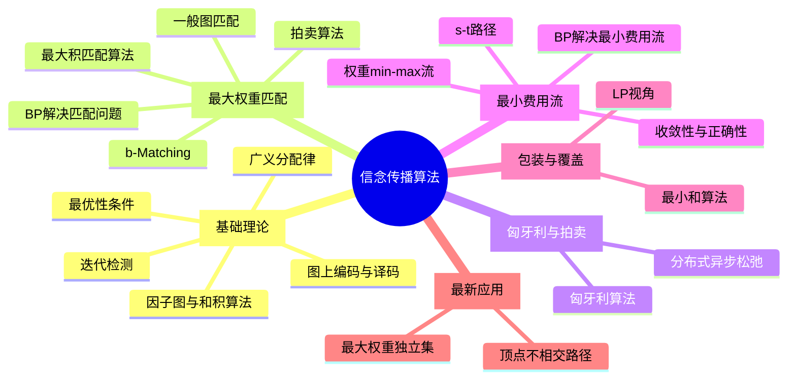

# 信念传播算法论文研究索引

> 📚 共计 **23 篇论文**，按主题分组，系统学习信念传播算法（Belief Propagation）。
> 
> 导师：张鹏 | 研究生：刘剑飞
> 
> 📄 原始邮件：[[research/信念传播算法/邮件内容.md|导师建议]]

---

## 论文分组概览



---

## 📖 一、基础理论（Foundations）

| # | 论文 | 作者 | 年份 | 页数 | 主题 |
|---|------|------|------|------|------|
| 1 | [[research/信念传播算法/论文研读/(1)_[1]因子图与和积算法\|Factor graphs and the sum-product algorithm]] | Kschischang, Frey, Loeliger | 2001 | 22 | 因子图框架，BP算法的基础 |
| 2 | [[research/信念传播算法/论文研读/(1)_[2]广义分配律\|The generalized distributive law]] | Aji, McEliece | 2000 | 19 | BP的代数基础 |
| 3 | [[research/信念传播算法/论文研读/(1)_[10]图上编码与迭代译码\|Codes and iterative decoding on general graphs]] | Wiberg, Loeliger, Kotter | 1995 | 1 | 图上迭代译码 |
| 4 | [[research/信念传播算法/论文研读/(1)_[4]迭代检测\|Iterative Detection]] | — | — | 384 | 迭代检测（教材） |
| 5 | [[research/信念传播算法/论文研读/(3)_[23]最大积BP的最优性\|On the optimality of max-product BP in arbitrary graphs]] | Weiss, Freeman | 2001 | 9 | BP最优性条件 |

## 🎯 二、最大权重匹配（Maximum Weighted Matching）

| # | 论文 | 作者 | 年份 | 页数 | 主题 |
|---|------|------|------|------|------|
| 6 | [[research/信念传播算法/论文研读/(1)2006[Cheng, ..] - 二分图最大匹配的迭代消息传递\|Iterative message passing for bipartite max matching]] | Cheng, Neely, Chugg | 2006 | 5 | 二分图最大匹配 |
| 7 | [[research/信念传播算法/论文研读/(1)_[3]最大积BP的最大权重匹配\|Maximum weight matching via max-product BP]] | — | 2005 | 5 | MWM via BP |
| 8 | [[research/信念传播算法/论文研读/(2)2008[Bayati, ..] - 基于最大积BP的最大匹配\|Max matching via max-product BP]] | Bayati, Shah, Sharma | 2008 | 13 | BP最大匹配 |
| 9 | [[research/信念传播算法/论文研读/(2)_[4]简化的最大积MWM与拍卖算法\|A Simpler Max-Product MWM and the Auction Algorithm]] | Bayati, Shah, Sharma | 2006 | 5 | 简化版本 |
| 10 | [[research/信念传播算法/论文研读/(3)2008[Bayati, ..] - 最大积MWM收敛性正确性与LP对偶\|Max-Product for MWM: Convergence, Correctness, LP Duality]] | Bayati, Shah, Sharma | 2008 | 11 | TIT期刊版 |
| 11 | [[research/信念传播算法/论文研读/(8)2018[Holldack] - 最大积最大匹配重访\|Max-product for max matching revisited]] | Holldack | 2018 | 5 | 重新审视 |
| 12 | [[research/信念传播算法/论文研读/(6)_[13]一般图加权匹配的BP与LP松弛\|BP and LP Relaxation for Weighted Matching in General Graphs]] | Sanghavi etc. | 2011 | 10 | 一般图匹配 |
| 13 | [[research/信念传播算法/论文研读/(9)_[3]一般图上的加权b-Matching的BP\|BP for Weighted b-Matchings on Arbitrary Graphs]] | Bayati, Borgs, Chayes, Zecchina | 2011 | 23 | b-Matching |

## 🔧 三、匈牙利算法与拍卖算法（Hungarian & Auction）

| # | 论文 | 作者 | 年份 | 页数 | 主题 |
|---|------|------|------|------|------|
| 14 | [[research/信念传播算法/论文研读/(1)_[5]匈牙利算法\|The Hungarian method for the assignment problem]] | Kuhn | 1955 | 15 | 经典匈牙利算法 |
| 15 | [[research/信念传播算法/论文研读/(1)_[6]分布式异步松弛算法\|A Distributed Asynchronous Relaxation Algorithm]] | Bertsekas | 1985 | 2 | 拍卖算法基础 |

## 💰 四、最小费用流（Min-Cost Flow）

| # | 论文 | 作者 | 年份 | 页数 | 主题 |
|---|------|------|------|------|------|
| 16 | [[research/信念传播算法/论文研读/(4)2012[Gamarnik, ..] - 最小费用网络流的BP收敛性与正确性\|BP for Min-Cost Network Flow: Convergence and Correctness]] | Gamarnik, Shah, Wei | 2012 | 19 | OR期刊版 |
| 17 | [[research/信念传播算法/论文研读/(5)2012[Gamarnik, ..] - 最小费用流的BP算法\|Belief propagation for min-cost flow]] | Gamarnik, Shah, Wei | 2012 | 34 | 完整版本 |
| 18 | [[research/信念传播算法/论文研读/(9)_[6]权重min-max流的BP收敛性与正确性\|Convergence of BP for weighted min-max flow]] | — | 2024 | 9 | min-max流 |
| 19 | [[research/信念传播算法/论文研读/(4)_[A]最小和算法的s-t路径\|s-t paths using the min-sum algorithm]] | — | 2008 | 4 | s-t路径 |

## 📦 五、包装与覆盖问题（Packing & Covering）

| # | 论文 | 作者 | 年份 | 页数 | 主题 |
|---|------|------|------|------|------|
| 20 | [[research/信念传播算法/论文研读/(6)2015[Even, ..] - 包装与覆盖问题的最小和算法分析\|Min-sum for Packing and Covering via LP]] | Even, etc. | 2015 | 11 | TIT期刊版 |
| 21 | [[research/信念传播算法/论文研读/(7)2015[Even, ..] - 包装覆盖问题的Min-sum算法\|Min-sum algorithm for packing and covering]] | Even, etc. | 2015 | 18 | 完整版本 |

## 🚀 六、最新应用（Recent Applications）

| # | 论文 | 作者 | 年份 | 页数 | 主题 |
|---|------|------|------|------|------|
| 22 | [[research/信念传播算法/论文研读/(9)2022[Dai, Guo, ..] - 顶点不相交最短路径的迭代消息传递\|Iterative message passing for vertex disjoint shortest paths]] | Dai, Guo, etc. | 2022 | 9 | 顶点不相交路径 |
| 23 | [[research/信念传播算法/论文研读/(9)_[24]最大权重独立集的消息传递\|Message-Passing for Maximum-Weight Independent Set]] | — | — | 13 | MWIS |

---

## 🔗 论文关联图谱

### 按引用关系
```
Kschischang (2001) ──> Aji & McEliece (2000)
    │                     │
    ├──> Weiss & Freeman (2001)
    │
    ├──> Cheng (2006) ──> Bayati (2008) ──> Holldack (2018)
    │                        │
    │                        ├──> Bayati b-Matching (2011)
    │                        └──> Sanghavi (2011,一般图匹配)
    │
    └──> Gamarnik (2012) ──> 权重min-max流 (2024)
    │
    └──> Even (2015) ──> Dai (2022)
                             │
                             └──> MWIS
```

### 按问题类型
- **匹配问题家族**: 论文 6,7,8,9,10,11,12,13 → 核心主线
- **流问题家族**: 论文 16,17,18,19
- **包装覆盖家族**: 论文 20,21,22,23
- **理论基础**: 论文 1,2,3,4,5

---

## 📋 推荐阅读顺序

### 路线一：从基础开始（推荐新手）
```
基础理论 (1→2→5) → 匹配问题 (6→8→10) → 拍卖算法(15) 
→ 流问题(16→19) → 包装覆盖(20→22) → 最新应用(22→23)
```

### 路线二：从具体问题切入（推荐）
```
匹配问题(6→7)遇到困难 → 基础理论(1→2) → 深入匹配(8→9→10→11→12→13) 
→ 拍卖(14→15) → 流问题(16→17→18→19) → 包装覆盖(20→21) → 最新应用(22→23)
```

### 路线三：最简快速路径
```
论文1(因子图) + 论文5(最优性) + 论文10(Bayati TIT) → 选择具体问题深入
```

---

## 📝 学习进度跟踪

- [ ] 基础理论学习完成
- [ ] 匹配问题系列完成
- [ ] 匈牙利与拍卖算法完成
- [ ] 最小费用流系列完成
- [ ] 包装与覆盖完成
- [ ] 最新应用完成

---

> 🔗 相关笔记：[[research/信念传播算法/邮件内容.md|导师邮件]] | [[research/信念传播算法/论文研读/模板/读书笔记模板.md|读书笔记模板]]


