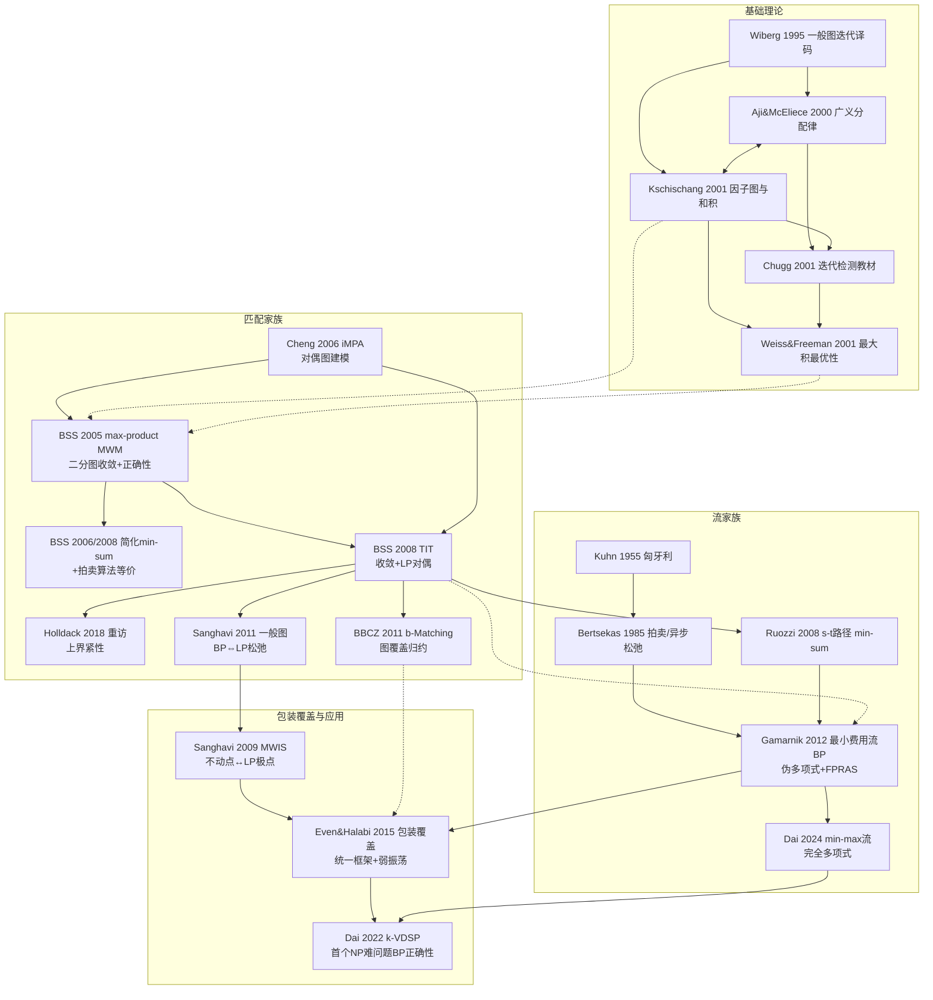

# 信念传播算法知识关联图谱

> 📚 本图谱是 23 篇论文的**知识中枢**：记录概念、算法、证明技巧在论文间的传承与关联。
> 
> 用途：当你问我某篇论文的某个部分时，我会以此图谱为索引，串联其他论文的相关知识。
> 
> 配套：[[研究主页|论文索引]] | [[研究主页|研究主页]]

---

## 〇、一张图看懂全局



---

## 一、全局演进主线

### 主线 1：从"图上消息传递"到"组合优化"（建模语言的传承）

```
Gallager 1962 (LDPC) → Tanner 1981 (Tanner图) → Wiberg 1995 (一般图迭代译码, hidden变量)
→ Aji & McEliece 2000 (GDL: 半环抽象+MPF问题+junction tree精确性)
→ Kschischang 2001 (因子图+和积算法, 统一BCJR/Viterbi/Kalman/FFT/Pearl BP)
→ Weiss & Freeman 2001 (任意图上 max-product 固定点 = SLT邻域最大, 计算树工具)
→ [关键转折] 用 max-product/min-sum 解组合优化问题：
   二分匹配 (BSS 2005) → 一般图匹配 (Sanghavi 2011, BBCZ 2011)
   → 最小费用流 (Gamarnik 2012) → 包装覆盖 (Even&Halabi 2015) → k-VDSP (Dai 2022)
```

### 主线 2：从"原始-对偶算法"到"消息传递"（价格→消息的升级）

```
Kuhn 1955 (匈牙利: 对偶价格 u_i, v_j + 互补松弛 + 增广路径)
→ Bertsekas 1985 (拍卖: 标量价格 p_j, ε-互补松弛, 分布式异步)
→ BSS/Cheng (消息 = 顶点的标量"价格"/信念)
→ Gamarnik 2012 (消息 = 分段线性凸**函数**, 价格函数化)
→ Dai 2024 (min-max 代数下的消息)
```

### 主线 3：精确性条件的三次升级（"什么时候 BP 是对的"）

| 阶段 | 条件 | 代表论文 |
|------|------|---------|
| 树上精确 | 因子图无环 → 和积/最大积精确 | Kschischang 2001, Aji&McEliece 2000 |
| 邻域最优 | 任意图, 固定点 = SLT邻域最大 | Weiss&Freeman 2001 |
| 组合优化收敛 | **最优解唯一** (或 LP 无分数解) → 收敛到全局最优 | BSS 2005/2008, Cheng 2006, Sanghavi 2011, BBCZ 2011, Gamarnik 2012, Dai 2022/2024 |
| 更弱条件 | 残差网络无负环 o(x*)>0 (不再依赖LP) | Dai 2022 (k-VDSP) |

---

## 二、概念桥梁（跨论文共享的核心概念）

> 这些概念在多个论文中反复出现，是关联知识的"钩子"。

### 1. 消息传递更新规则（各论文的"变体谱系"）

**通用模式**：`新消息 = 自身信息 + 邻居消息的组合（max/求和/min），排除目标方向`

| 论文 | 消息载体 | 初值 | 更新核心 | 判定 |
|------|---------|------|---------|------|
| Kschischang 2001 | 任意值函数 | — | 变量→因子: 乘积; 因子→变量: summary | 边缘=消息积 |
| Weiss&Freeman 2001 | 后验概率函数 | 任意 | max-product 不动点方程 | argmax 信念 |
| Cheng 2006 | 标量 | -max(其他权重) | $m = -\max_{\ell\ne j}(M_{\ell}+w)$ | 阈值 $M_{ij}>0$ |
| BSS 2005 | n维向量 | $w$ (或 $e^w$) | $\Psi^t *(\odot M)\odot\Phi$ | argmax 信念 |
| BSS 简化 min-sum 2008 | 标量 | $w_{ij}$ | $\hat m = w_{ij}-\max_{\ell\ne j}\hat m$ | argmax |
| Sanghavi 2011 | 标量(边↔因子) | 1 | var↔factor max-product | 三值 1/0/? |
| BBCZ 2011 b-Matching | 标量(顶点↔顶点) | $w_{ij}$(任意) | $w_{ij}-$第$b_i$小 | 选$b_i$小/负消息边 |
| Gamarnik 2012 | 分段线性凸函数 | — | 消息 = 局部代价函数 + min(邻居消息) | argmin 信念 |
| Ruozzi 2008 | 函数(边↔顶点) | — | min-sum 守恒约束 | 信念比较 $b(1)<b(0)$ |
| Even&Halabi 2015 | 函数 | 0 (零初始化) | 变量→约束: 和; 约束→变量: max(合法赋值) | $\delta_{v,t}$ 集合, 奇偶取min/max |
| Dai 2022 | 函数(弧↔端点) | 0 | 弧→端点: +费用; 端点→弧: min(约束+邻居) | argmin 信念 |
| Dai 2024 | 函数 | $w_ex_e$ | **max** 替代 sum | argmin 信念 |

### 2. 对偶价格 / 势 / 消息（同一条概念链）

```
匈牙利对偶价格 u_i, v_j (Kuhn 1955)
→ 拍卖价格 p_j, 利润 π_i (Bertsekas 1985)
→ BP 消息 m (BSS/Cheng: 标量价格)
→ BP 消息 = 局部代价函数 (Gamarnik 2012: 价格函数化)
→ min-max 消息 (Dai 2024)
```

**要点**：拍卖算法 = 解匹配 LP 松弛的**对偶**（BSS 2008 TIT 明确点题）。这条链是理解"BP 与 LP 的关系"的关键。

### 3. 计算树 / 展开树（unwrapped tree / computation tree）

- 起源：Wiberg 博士论文，Weiss&Freeman 2001 系统化（任意拓扑）
- 核心事实：**第 k 轮 BP 的消息 = 深度 k 计算树上的精确最优解**
- 用途：把"带环图上的迭代"转化为"树上的精确问题"，再用组合论证
- 继承：BSS 2005 → Cheng 2006 → Sanghavi 2011 → BBCZ 2011 → Ruozzi 2008 → Gamarnik 2012 (根=弧) → Even&Halabi 2015 (路径前缀树) → Dai 2022 (根=弧) → Dai 2024

### 4. 唯一性条件 → 收敛（"间隙决定速度"）

| 论文 | 唯一性度量 | 迭代次数界 |
|------|-----------|-----------|
| BSS 2005 | $\varepsilon$ = 最优-次优权差 | $\lceil 2nw^*/\varepsilon\rceil$ |
| Cheng 2006 | $\varepsilon$ = 最优-次优权差 | $3nw^*/\varepsilon$ |
| BSS 简化 2008 | $\varepsilon$ | $O(nw^*/\varepsilon)$ 轮 |
| Sanghavi 2011 | LP 多胞体"尖锐度" δ | 依赖 δ |
| BBCZ 2011 | $\varepsilon'$ (互补松弛间隙) | $\lceil 4nw^*/\varepsilon'\rceil$ |
| Bertsekas 1985 | $v^*-v$ (最优-次优指派差) | $O(N^3)$ ($\varepsilon < (v^*-v)/(N-1)$ 时精确) |
| Ruozzi 2008 | $w(P^*)$ = 最短路权重 | $w(P^*)(w(P^*)+w_{min})/w_{min}$ |
| Gamarnik 2012 | $L/\delta(x^*)$ (残差网络最长路径/最小环) | $(\lfloor L/(2\delta)\rfloor+1)\cdot n$ |
| Even&Halabi 2015 | $c(P,w)$ (LP 锐度) | $w_{max}/c(P,w)$ (仅列度≤2) |
| Dai 2022 | $U/o(x^*)$ (残差网络路径/环) | $(\lceil U/(2o(x^*))\rceil+1)\cdot n$ |
| Dai 2024 | 唯一最优解 | **$n/2$ 轮 (与权重无关!)** |

**共同规律**：收敛轮数 ≈ 图规模 × (权重规模 / 唯一性间隙)。Dai 2024 突破：min-max 代数下与权重无关 → 完全多项式 $O(n^3)$。

### 5. LP 松弛与总模性（BP 表现的上限）

- **匹配 (二分)**: 匹配多胞体顶点全整 → "IP 唯一 ⇔ LP 唯一" (BSS 隐含)
- **匹配 (一般图)**: 需奇环约束; LP 无分数最优 ⇔ BP 收敛 (Sanghavi 2011 正定理); LP 有分数最优 ⇒ BP 振荡 (Sanghavi 2011 逆定理)
- **b-Matching**: LP 无分数解 ⇔ BP 收敛; 有分数解时可**用 BP 解 LP** (BBCZ 2011, 图覆盖+扰动)
- **流问题**: 约束矩阵 TU → 整数最优 ⟺ 松弛唯一解 (Ruozzi 2008)
- **MWIS**: 半整数极点; 紧性(无积分间隙) 是 BP 最优性的**必要不充分**条件 (Sanghavi 2009)
- **k-VDSP**: LP 有积分间隙(分数解) → **绕过 LP**, 改用残差网络条件 (Dai 2022)

### 6. 增广路径 / 交替路径（证明中的万能工具）

- 匈牙利: transfer/增广路径 (Kuhn 1955)
- BSS: 计算树上交替路径投影回原图 → 分解为简单圈+偶长路径 (2005/2008)
- Gamarnik: 树上最优流与原图最优流的差 → 残差网络增广路径 + 环分解 (2012)
- Dai 2022: 交替路径 γ(P) 是残差网络上的有向 walk → 路径+环分解, 环数 > U/o(x*)
- Dai 2024: 沿路径推 ε 流, 三种取向情形验证可行性

---

## 三、证明工具箱（各论文的证明方法传承）

| 方法 | 使用论文 | 说明 |
|------|---------|------|
| 分配律/归纳 (树上精确) | Kschischang, Aji&McEliece | 树上消息传递 = 复用中间值的精确计算 |
| 计算树 + 归纳 | BSS, Cheng, Sanghavi, BBCZ, Ruozzi, Gamarnik, Even, Dai×2 | BP 第 k 轮 = 深度 k 树上的精确解 |
| 交替路径 + 唯一性间隙反证 | BSS, Cheng, Gamarnik, Dai×2 | 树上解错 → 构造改进矛盾 |
| LP 对偶 + 互补松弛 | Kuhn, Bertsekas, BSS TIT, BBCZ | 拍卖/对偶算法终止即最优 |
| 扰动论证 (构造新 LP 最优) | Sanghavi 2011, Even&Halabi (推广) | 把矛盾提升到 LP 层面 |
| 图覆盖/lifting | BBCZ (双覆盖→二分归约), Even&Halabi (M-lift) | 任意图 → 二分图/树 |
| 不动点结构分析 | Weiss&Freeman, Sanghavi 2009 | 不动点 ↔ 多面体极点 |
| 对偶坐标下降 + 原始恢复 | Sanghavi 2009 (收敛算法) | BP 不收敛时改造算法 |
| Nibbling Lemma + 素数计数 | Holldack 2018 | 证明收敛上界紧性 |
| 分段线性凸函数插值 | Gamarnik 2012 | 消息函数的有效实现 |
| Isolation Lemma (LP版) + decimation | Gamarnik 2012 (FPRAS) | 随机扰动保证唯一性 |

---

## 四、关键定理速查表

| # | 定理 | 内容 | 出处 |
|---|------|------|------|
| 1 | 树上精确性 | 无环因子图上和积算法精确计算边缘 | Kschischang 2001, Aji&McEliece 2000 |
| 2 | GDL 调度定理 | 消息传递完成 ⟺ 消息网格存在传播路径 | Aji&McEliece 2000 |
| 3 | 固定点=SLT邻域最大 | 任意图上 max-product 固定点给出 SLT 邻域最优 | Weiss&Freeman 2001 |
| 4 | 高斯精确性 | 高斯图上 BP 收敛则后验均值精确 | Weiss&Freeman 2001 (推论1) |
| 5 | BSS 收敛定理 | 二分图唯一 MWM ⇒ $\lceil 2nw^*/\varepsilon\rceil$ 轮收敛 | BSS 2005/2008 |
| 6 | Cheng 收敛定理 | 二分图唯一 MWM ⇒ $3nw^*/\varepsilon$ 轮收敛 | Cheng 2006 (定理1) |
| 7 | 拍卖终止最优 | 拍卖算法终止匹配 = MWM (LP对偶+互补松弛) | BSS 2006/2008 (定理5) |
| 8 | LP无分数最优⇔BP收敛 | 一般图匹配: LP 无分数最优 ⇒ BP 正确; 有分数最优 ⇒ BP 振荡 | Sanghavi 2011 (定理1,2) |
| 9 | BBCZ 收敛定理 | 任意图 LP 无分数解 ⇒ Sync-BP $\lceil 2nw^*/\varepsilon\rceil$ 轮收敛 | BBCZ 2011 (定理1) |
| 10 | BP 解 LP | 双覆盖图+随机扰动 ⇒ BP 给出 LP 最优解 | BBCZ 2011 (定理5) |
| 11 | 弱振荡定理 | 包装: t偶输出 ≥ x_max; t奇输出 ≤ x_min; 相邻轮相同 ⇒ LP最优值 | Even&Halabi 2015 (定理4-6) |
| 12 | 唯一整数LP最优是必要条件 | min-sum 收敛到整数最优 ⇒ LP 唯一且整数 | Even&Halabi 2015 (推论6) |
| 13 | 不动点↔LP极点 | MWIS 上不动点估计 ↔ LP 极点 (但权重可能错) | Sanghavi 2009 (定理4.1) |
| 14 | 自然初值解正确LP | 无信息初值下, 每时刻估计对应真实 LP 最优 | Sanghavi 2009 (定理5.1) |
| 15 | 最小费用流收敛 | 唯一最优 ⇒ $(\lfloor L/(2\delta)\rfloor+1)n$ 轮精确收敛 | Gamarnik 2012 (定理4.1) |
| 16 | BP首个FPRAS | decimation 程序给 $(1+\epsilon)$ 近似, 不需唯一性 | Gamarnik 2012 (§8) |
| 17 | 唯一性检测 | 整数数据跑 $n^2c_{max}+n$ 轮可用信念差检测唯一性 | Gamarnik 2012 (推论5.2) |
| 18 | k-VDSP 收敛 | 唯一最优 ⇒ $(\lceil U/(2o(x^*))\rceil+1)n$ 轮收敛, $O(n^2w_{max})$ | Dai 2022 (定理1,推论2) |
| 19 | min-max 流收敛 | 唯一最优 ⇒ **$n/2$ 轮**收敛, $O(n^3)$ 完全多项式 | Dai 2024 (定理1) |
| 20 | BSS 上界紧性 | 2nw*/ε 上界紧到因子4; BP 最坏收敛指数级 | Holldack 2018 (定理2,3) |

---

## 五、论文间关联明细

### 基础理论组
- **[[(1)_[1]因子图与和积算法]]** (Kschischang 2001)
  - 前置: Wiberg 1995 (Tanner图), Aji&McEliece 2000 (MPF)
  - 延伸: Chugg 2001 (教材化), Weiss&Freeman 2001 (最优性), 全部后续论文(建模语言)
  - 核心: 因子图 + 和积规则 + 半环替换(min-sum/max-product)
- **[[(1)_[2]广义分配律]]** (Aji&McEliece 2000)
  - 前置: Gallager/Tanner/Wiberg 谱系
  - 延伸: 与因子图论文互译; junction tree 精确性
  - 核心: 半环抽象 + MPF 问题 + 调度定理
- **[[(1)_[10]图上编码与迭代译码]]** (Wiberg 1995)
  - 核心: "有环图上也能跑消息传递"的信念源头; cycle code 代数刻画
  - 延伸: 因子图, GDL, 教材, Weiss&Freeman
- **[[(1)_[4]迭代检测]]** (Chugg 2001 教材)
  - 核心: 从检测理论综合; CM≡MPF, 半环算法≡GDL; 无环充分最优性
  - 用法: 术语查证 + 工程直觉 (SISO, extrinsic/intrinsic, 调度)
- **[[(3)_[23]最大积BP的最优性]]** (Weiss&Freeman 2001)
  - 前置: 因子图/GDL, Wiberg
  - 延伸: **全部**组合优化论文的理论基石 (计算树工具, SLT邻域思想)

### 最大权重匹配组
- **[[(1)2006[Cheng, ..] - 二分图最大匹配的迭代消息传递]]** ✅ 已读
  - 与 BSS 平行: 对偶图建模 (边变量+行/列约束 vs 顶点变量+配对约束)
  - 独特: 内存 $O(n)$, 阈值判定, 整数权重扰动处理
  - 延伸: BSS 2008, 后续匹配系列
- **[[(1)_[3]最大积BP的最大权重匹配]]** (BSS 2005) — 匹配系列的**开山之作**
  - 核心: 二分图 MWM + max-product; 计算树+交替路径证明范式
  - 延伸: 简化版(2006), 完整版(2008 arXiv), TIT版(2008), 一般图(2011)
- **[[(2)2008[Bayati, ..] - 基于最大积BP的最大匹配]]** (2008 arXiv 完整版)
  - 含简化 min-sum + 拍卖算法等价 + LP 对偶
- **[[(2)_[4]简化的最大积MWM与拍卖算法]]** (2006 ISIT)
  - 核心: 向量→标量 ($O(n^3)$); 拍卖等价
- **[[(3)2008[Bayati, ..] - 最大积MWM收敛性正确性与LP对偶]]** (TIT 2008)
  - **关键洞见: 拍卖算法 = 解匹配 LP 松弛的对偶**
  - 延伸: Sanghavi 2011, BBCZ 2011
- **[[(8)2018[Holldack] - 最大积最大匹配重访]]**
  - 核心: BSS 上界紧到因子4; 最坏指数级; 近似BP
- **[[(6)_[13]一般图加权匹配的BP与LP松弛]]** (Sanghavi 2011)
  - 核心: BP 表现 ⟺ LP 无分数最优; 正/逆定理; 三值估计
  - 关联: 独立同批 BBCZ 2011
- **[[(9)_[3]一般图上的加权b-Matching的BP]]** (BBCZ 2011)
  - 核心: 图覆盖(双覆盖→二分)归约; 异步BP首次证明; LP有分数解时用BP解LP

### 匈牙利与拍卖组
- **[[(1)_[5]匈牙利算法]]** (Kuhn 1955)
  - 核心: 原始-对偶方法; 对偶价格+互补松弛+增广路径 (后续一切算法的骨架)
  - 关联: König定理 (最大匹配=最小点覆盖); 指派=单位最小费用流
- **[[(1)_[6]分布式异步松弛算法]]** (Bertsekas 1985)
  - 核心: 拍卖算法; ε-互补松弛; 分布式异步
  - 关联: 匈牙利的价格分布式版; BP 消息的"一阶"祖先

### 最小费用流组
- **[[(4)2012[Gamarnik, ..] - 最小费用网络流的BP收敛性与正确性]]** (OR 2012)
- **[[(5)2012[Gamarnik, ..] - 最小费用流的BP算法]]** (arXiv 完整版) — **同一篇的两个版本, 合并学习**
  - 核心: 消息=分段线性凸函数; 伪多项式精确收敛; 唯一性检测; 首个BP-FPRAS
  - 关联: 直接推广 BSS 2008; 二分匹配⊂MCF子类
- **[[(9)_[6]权重min-max流的BP收敛性与正确性]]** (Dai 2024)
  - 核心: max 替代 sum; $n/2$ 轮收敛; $O(n^3)$ 完全多项式 (超越已知 $O(n^6)$ 算法)
  - 关联: 直接承袭 Gamarnik 2012 的证明框架
- **[[(4)_[A]最小和算法的s-t路径]]** (Ruozzi 2008)
  - 核心: TU ⇒ LP松弛唯一; 计算树上问题≠原问题(多源多汇); 收敛由权重间隙决定
  - 关联: 最短路=单位流 ⊂ Gamarnik 的 MCF_o 子类

### 包装与覆盖组
- **[[(6)2015[Even, ..] - 包装与覆盖问题的最小和算法分析]]** (TIT)
- **[[(7)2015[Even, ..] - 包装覆盖问题的Min-sum算法]]** (arXiv) — **同一篇的两个版本, 合并学习**
  - 核心: 统一框架 (匹配/独立集/边覆盖/b-匹配全是特例); 弱振荡定理; 图覆盖证明
  - 关键: LP 唯一整数最优是收敛的**必要条件**(不充分)
  - 关联: 推广 MWIS 2009 与匹配系列; 覆盖归约到包装 (补变换)

### 最新应用组
- **[[(9)_[24]最大权重独立集的消息传递]]** (Sanghavi 2009)
  - 核心: 不动点↔LP极点; 自然初值解正确LP; 紧性必要不充分; 对偶坐标下降收敛算法
  - 关联: MWIS 是包装问题特例; 反例被 Even&Halabi 引用
- **[[(9)2022[Dai, Guo, ..] - 顶点不相交最短路径的迭代消息传递]]** (Dai 2022) ⭐ 导师重点关注
  - 核心: 首个 NP 难问题上 BP 正确性证明 (唯一最优 ⇒ $O(n^2w_{max})$ 轮)
  - **写作质量差**: 消息初值不清、调度未严格化、收敛判据未定义、引理4证明跳跃(见该笔记"疑问与思考")
  - 关联: 谱系终点 — Cheng/Bayati(匹配) → BBCZ/Sanghavi(b匹配) → Gamarnik(流) → Even(覆盖) → 本文(路径)

---

## 六、阅读建议（基于你已读完 Cheng 2006）

你的进度：✅ Cheng 2006 (iMPA, 二分图匹配的迭代消息传递)

### 推荐路线（路线二的实际执行）

```
已完成: Cheng 2006 (第6篇)
下一步(匹配主线, 与Cheng直接相关):
  ┌─ (2) BSS 2005 开山之作 ─┐
  │   (与Cheng互为对偶图建模) │
  └─ (3) BSS 2008 完整版 ←──┘  ← 包含简化算法和拍卖
  ↓
  (4) BSS 2008 TIT 期刊版 (收敛+LP对偶, 最关键的一篇)
  ↓
  并行可选:
  ├─ (5) Holldack 2018 (重访, 上界紧性)
  ├─ (6) Sanghavi 2011 (一般图, LP松弛视角)
  ├─ (7) BBCZ 2011 (b-Matching, 图覆盖)
  └─ (8) Kuhn 1955 + Bertsekas 1985 (匈牙利/拍卖, 理解对偶根基)
```

> 💡 **提示**：你已读的 Cheng 2006 与 BSS 系列互为对偶建模，读 BSS 2005 时重点对比两种建模方式；读 BSS TIT 2008 时重点理解"拍卖算法=LP对偶"——这是连接匹配→流→覆盖全谱系的关键枢纽。

---

## 相关笔记

- [[研究主页|论文索引]]
- [[研究主页|研究主页]]
- [[邮件内容|导师邮件]]
- 📄 论文全文文本：`信念传播算法/参考资料/全文转换/` (23 篇可检索)
